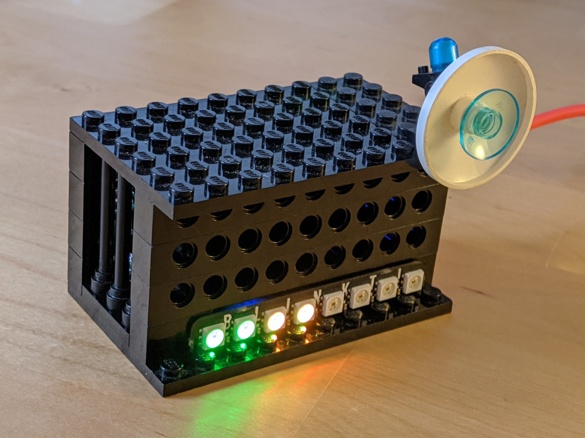
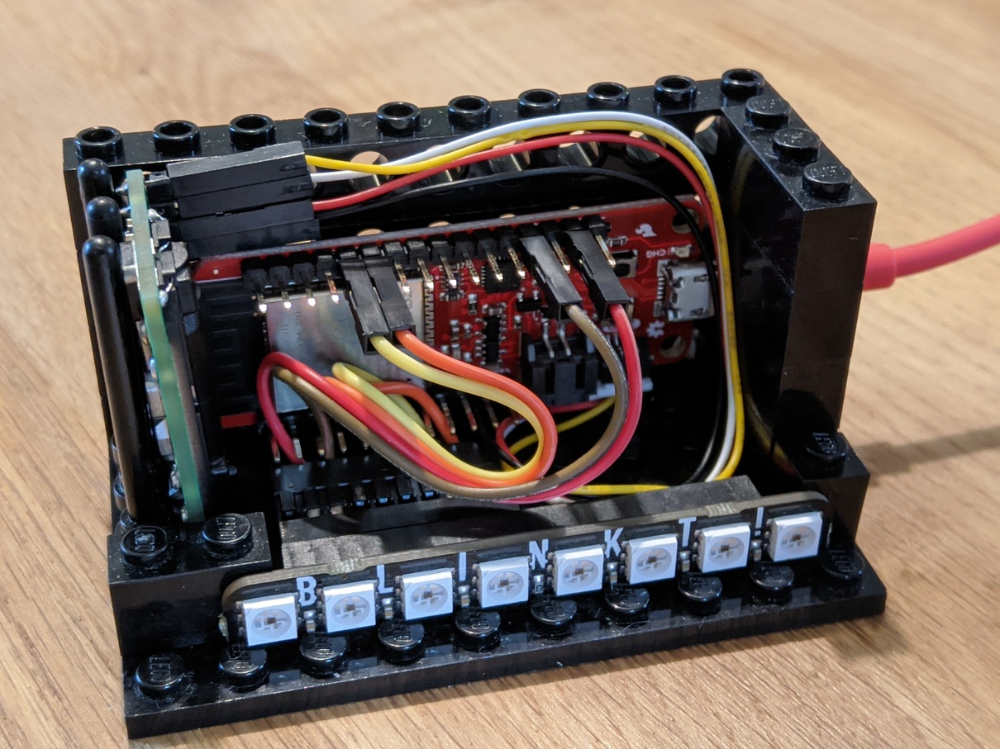
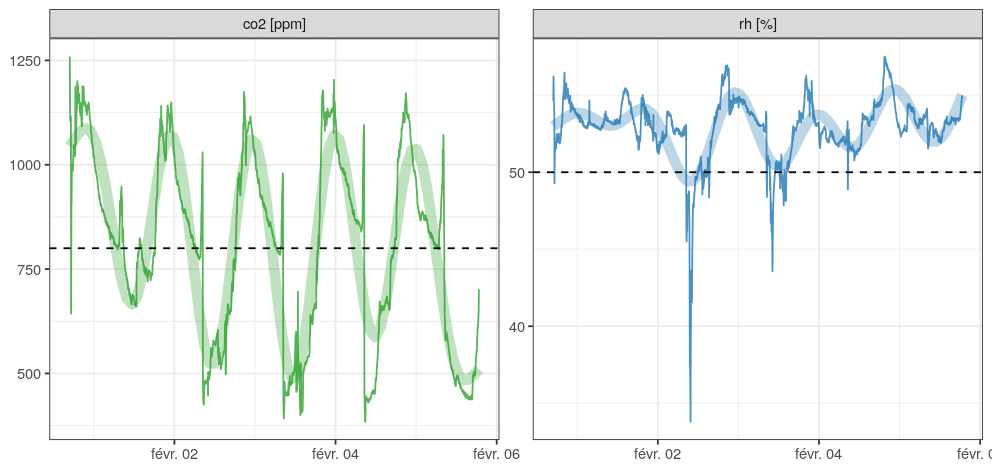

# Measure, log, and analyse home climate variables 

## LEGO CO2 Sensor

The aim is to mitigate the risk of indoor airborne SARS transmission by providing a visual guidance for an adequate ventilation using CO2 concentration as a proxy (additional information in [EN](https://assets.publishing.service.gov.uk/government/uploads/system/uploads/attachment_data/file/928720/S0789_EMG_Role_of_Ventilation_in_Controlling_SARS-CoV-2_Transmission.pdf) or [FR](https://projetco2.fr/)).

The first version of the sensor is based on a NDIR CO2 sensor, an ESP32 microcontroller board, and a 8 LED board used as status indicator. While compatible hardware parts would yield the same results (alternative board, single RGB LED), the software code in this repository should probably be adapted. Specifically, this hardware was used in the project :

* Sensirion SCD30 CO2 sensor ([link](https://www.sensirion.com/en/environmental-sensors/carbon-dioxide-sensors/carbon-dioxide-sensors-scd30/))
* SparkFun Thing Plus ESP32 board ([link](https://www.sparkfun.com/products/15663))
* Pimoroni Blinkt! LED status indicator ([link](https://shop.pimoroni.com/products/blinkt))

The number of LED on is function of the CO2 concentration, ranging from 600 to 1800 ppm (150 ppm per LED). LED color indicates air quality thresholds : green in the [600, 900[ ppm range, yellow in the [900, 1500[ ppm range, and red in the [1500, 1800[ ppm range.
Additionally, when the board is connected to the internet by WiFi, the measured data is uploaded to a cloud service (here using ThingSpeak API), and retrieved and analysed in R (example graph).

### Hardware

1. solder the 4-pin headers to the SCD30 sensor
2. connect the SCD30 sensor to the microcontroller board, using I2C protocol. In this case the JST connector on the microcontroller board is used (yellow = +3V, white = GND, red = SCL, black = SDA).
3. connect the LED board ([pinout](https://pinout.xyz/pinout/blinkt#)) to the microcontroller board ([pinout](https://cdn.sparkfun.com/assets/learn_tutorials/8/5/2/ESP32ThingPlusV20.pdf)), using SPI protocol. In this case the LED board is directly attached to the ESP32 headers (red = +3V, brown = GND, yellow = SCL/MOSI, orange = SDA/SCK).
4. build the LEGO box using : 6x10 plate (2), 1x10 brick (7), 1x3 brick (2), 1x2 brick (3), 1x1 brick (1). 

### Software

1. use your favorite IDE to upload the code ([ino](src/scd30/scd30_iot.ino) file) to the ESP32. Three arduino libraries are necessary : mathworks/ThingSpeak @ 2.0.0, adafruit/Adafruit DotStar@^1.1.4, Seeed-Studio SCD30 ([link](https://github.com/Seeed-Studio/Seeed_SCD30.git))
2. you can retrieve and analyre logged data by using this example R script ([link](R/homeclimate.rmd)), that produced the figure below.

